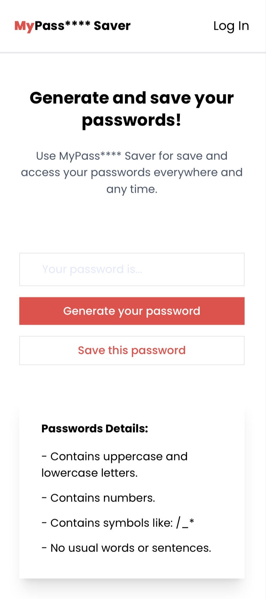

<h1 align="center"> 
  🚀 MyPass**** Saver 🚀.
</h1>

    

## 🔧 Technologies

- [ReactJS](https://https://reactjs.org/)
- [Vite](https://vitejs.dev/)
- [TypeScript](https://www.typescriptlang.org/)
- [TailwindCSS](https://tailwindcss.com/)

## 🔨 To run this project follow the steps below:  

Clone down this repository. You will need `node` and `npm` installed globally on your machine.

Run:

`git clone https://github.com/hendellcosta/my-password-saver.git`

`cd my-password-saver`

Installation:

`npm install`

To Start Server:

`npx vite --host`  

To Visit App:

`localhost:5173`  

<!-- Hendell Costa -->
